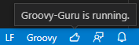
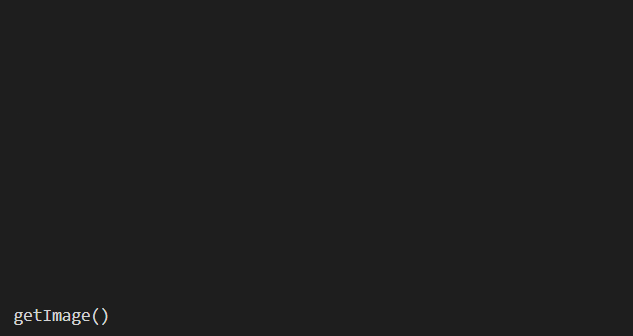

# Groovy IntelliSense for Visual Studio Code
[](https://github.com/DontShaveTheYak/groovy-guru/actions/workflows/test.yml?query=branch%3Amaster)
[][VS Code Groovy extension]

The [Groovy-Guru][VS Code Groovy extension] extension
provides rich language support for the
[Groovy](https://groovy-lang.org/) programming language, using the Groovy [Language Server](https://github.com/prominic/groovy-language-server). You can also install [Groovy-Guru][VS Code Groovy extension] using the [Jenkins Extension Pack](https://marketplace.visualstudio.com/items?itemName=DontShaveTheYak.jenkins-extension-pack), which is a must have when developing pipelines for Jenkins.

## Quick Start

Welcome! 👋🏻<br/>
Whether you are new to Groovy or an experienced Groovy developer, we hope this
extension fits your needs and enhances your development experience.

* **Step 1.** If you haven't done so already, install [Java 1.8 aka 8](https://www.java.com/en/download/help/index_installing.html)
  and the [VS Code Groovy extension].
  * [Managing extensions in VS Code].
* **Step 2.** To activate the extension, open any directory or workspace
  containing Groovy code and look for the thumbs up! 👍  
  

You are ready to get Groovy :-) &nbsp;&nbsp; 🎉🎉🎉

## Features

The extension is currently a work-in-progress but does provide basic IntelliSense. We plan to extend this extension to include code navigation and code editing.

- Code completion and Signature help
  
- See GroovyDoc strings on Classes, Fields, Methods and Functions.
  

## Build from source

You first need to build the language server.

```sh
yarn run build
```

Now you can install it into vscode.

- Using the CLI
  ```sh
  code --install-extension groovy-guru-0.0.0.vsix
  ```

- Using the GUI
  - Type `ctrl` + `shift` + `p`
  - Then type `Extensions: Install from VSIX`
  - Then find this directory and select `groovy-guru-0.0.0.vsix`

## Acknowledgements
* [Groovy Language Server](https://github.com/prominic/groovy-language-server)
* [Moonshine IDE](https://moonshine-ide.com)
* [ScreenToGif](https://github.com/NickeManarin/ScreenToGif/)
<!-- * [Best-README-Template](https://github.com/othneildrew/Best-README-Template) -->

[Managing extensions in VS Code]: https://code.visualstudio.com/docs/editor/extension-gallery
[VS Code Groovy extension]: https://marketplace.visualstudio.com/items?itemName=DontShaveTheYak.groovy-guru
