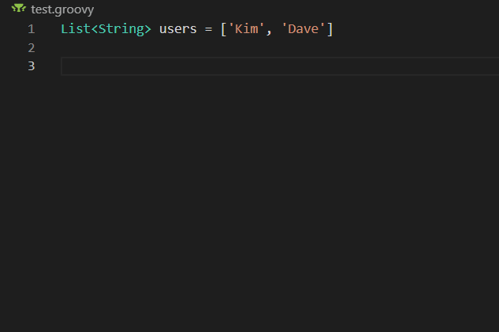

# Groovy IntelliSense for Visual Studio Code

<!--TODO: We should add a badge for the build status or link to the build dashboard.-->

[The Groovy-Guru extension](https://marketplace.visualstudio.com/items?itemName=DontShaveTheYak.groovy-guru)
provides rich language support for the
[Groovy programming language](https://groovy-lang.org/) using the [Groovy Language Server](https://github.com/prominic/groovy-language-server).

## Quick Start

Welcome! 👋🏻<br/>
Whether you are new to Groovy or an experienced Groovy developer, we hope this
extension fits your needs and enhances your development experience.

* **Step 1.** If you haven't done so already, install [Java 1.8 aka 8](https://www.java.com/en/download/help/index_installing.html)
  and the [VS Code Groovy extension].
  * [Managing extensions in VS Code].
* **Step 2.** To activate the extension, open any directory or workspace
  containing Groovy code.

You are ready to get Groovy :-) &nbsp;&nbsp; 🎉🎉🎉

## Features

The extension is currently a work-in-progress but does provide basic IntelliSense. We plan to extend this extension to include code navigation and code editing.

<p align=center>

<br/>
<em>(Code completion and Signature Help)</em>
</p>

## Build from source

You first need to build the language server.

```sh
yarn run build-server
```

Then you can package the extension.
```sh
yarn run build-extension
```

Now you can install it into vscode.

- Using the CLI
  ```sh
  code --install-extension groovy-guru-0.0.0.vsix
  ```

- Using the GUI - `ctrl` + `shift` + `p` then type "Extensions: Install from VSIX"

## Acknowledgements
* [Groovy Language Server](https://github.com/prominic/groovy-language-server)
* [Moonshine IDE](https://moonshine-ide.com)
* [ScreenToGif](https://github.com/NickeManarin/ScreenToGif/)
<!-- * [Best-README-Template](https://github.com/othneildrew/Best-README-Template) -->

[Managing extensions in VS Code]: https://code.visualstudio.com/docs/editor/extension-gallery
[VS Code Go extension]: https://marketplace.visualstudio.com/items?itemName=DontShaveTheYak.groovy-guru
